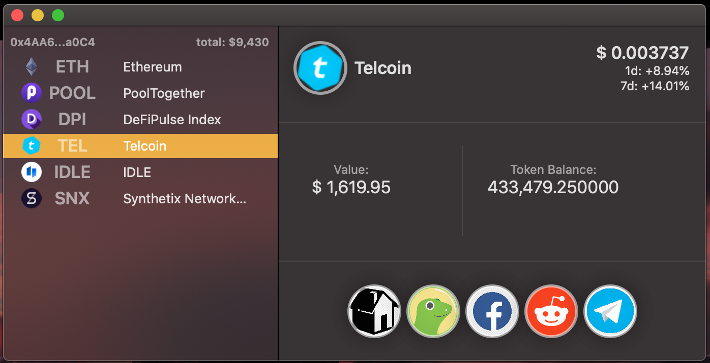

Recently, I have developed the macOS app that stay on menu bar regularly updating the address information including balance and value.

Features :
* Monitor Ethereum wallet balance on the menu bar
* Check the current Ethereum and gas price
* Support multiple addresses
* Track Ethereum and ERC-20 coin price and balance
* Display essential information only for crypto investors
* Quick access to useful links for each coins in the address
* Store wallet address data only in the local storage
* Minimum cpu and memory usage

This app utilizes APIs from
* Coingecko
* Etherscan
* Ethplorer